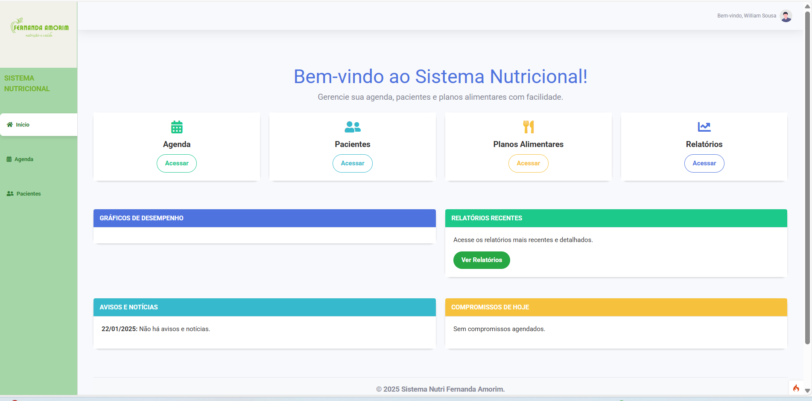
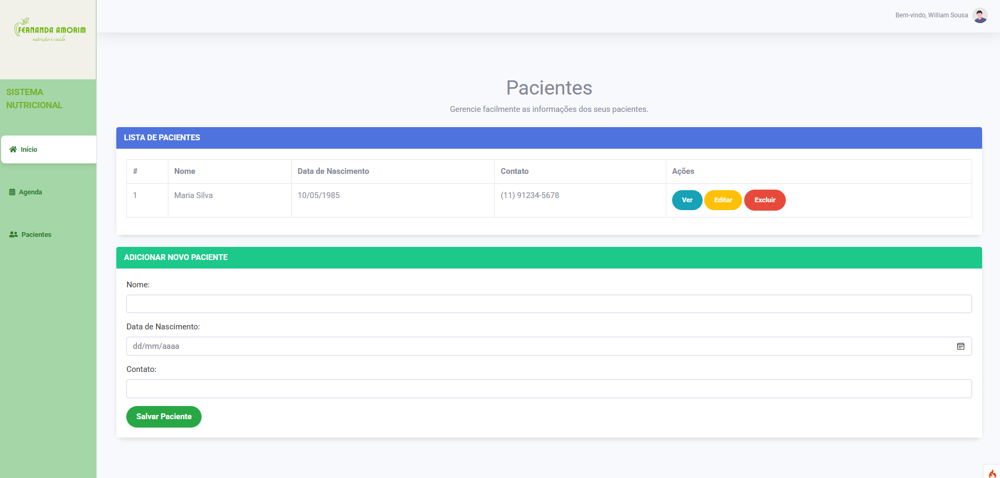
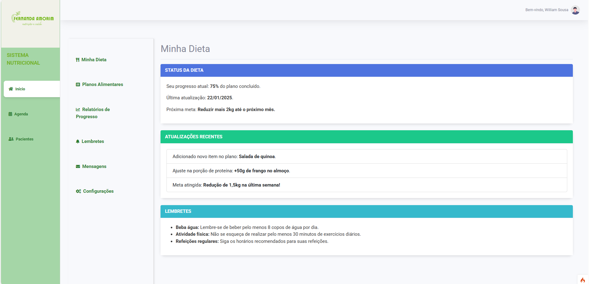

# 🥗 **Sistema Nutricional**

Bem-vindo ao **Sistema Nutricional**! Este sistema foi desenvolvido para facilitar a rotina de nutricionistas, oferecendo ferramentas práticas para gerenciar **agenda**, **pacientes**, **planos alimentares** e **relatórios de desempenho**.

---

## 🚀 **Sobre o Projeto**

O Sistema Nutricional é uma plataforma intuitiva e eficiente, criada para atender às necessidades de nutricionistas e melhorar a experiência no acompanhamento dos pacientes. O objetivo principal é simplificar o trabalho diário com recursos como gestão de agenda, criação de planos alimentares personalizados e visualização de relatórios detalhados.

🔹 **Principais Funcionalidades:**
- **Agenda**: Gerencie compromissos e visualize horários disponíveis.
- **Pacientes**: Controle de cadastro e informações nutricionais.
- **Planos Alimentares**: Criação e personalização de dietas.
- **Relatórios**: Acompanhamento do desempenho e progresso dos pacientes.
- **Avisos e Notícias**: Atualizações e comunicados importantes.

---

## 🛠 **Tecnologias Utilizadas**

- **PHP**: Linguagem principal para o backend.
- **CodeIgniter 4**: Framework utilizado para estruturação e organização do projeto.
- **Bootstrap**: Para criação de layouts responsivos e estilização.
- **FontAwesome**: Ícones modernos para enriquecer a interface.
- **MySQL**: Banco de dados para armazenamento de informações.

---

## 📂 **Estrutura do Sistema**

- **Agenda**: Controle de compromissos diários e futuros.
- **Pacientes**: Cadastro e gerenciamento de informações.
- **Planos Alimentares**: Planejamento de dietas personalizadas.
- **Relatórios**: Análises detalhadas sobre desempenho e progresso.
- **Avisos**: Comunicação direta sobre eventos ou atualizações.

---

## 🔧 **Como Executar o Projeto**

1. Clone o repositório:
   ```bash
   git clone https://github.com/seu-usuario/sistema-nutricional.git
   ```

2. Acesse o diretório do projeto:
   ```bash
   cd sistema-nutricional
   ```

3. Configure o arquivo `.env` para conexão com o banco de dados.

4. Rode as migrações para criar as tabelas no banco de dados:
   ```bash
   php spark migrate
   ```

5. Inicie o servidor local:
   ```bash
   php spark serve
   ```

6. Acesse o sistema no navegador:
   ```
   http://localhost:8080
   ```

---

## 📸 **Preview do Sistema**

### Dashboard:


### Gerenciamento de Pacientes:


### Planos Alimentares:


---

## ✨ **Próximas Implementações**

- Integração com APIs de nutrição para cálculo automático de macronutrientes.
- Sistema de notificações para lembretes de compromissos.
- Exportação de relatórios em PDF.
- Melhorias na responsividade para dispositivos móveis.

---

## 📞 **Contato**

Se você tiver dúvidas ou sugestões sobre o sistema, entre em contato:

- **Email:** williamdf2308@gmail.com
- **LinkedIn:** [https://www.linkedin.com/in/williamsousa-dev/](https://www.linkedin.com/in/williamsousa-dev/)

---